# Dashboard Interativo — Documentação

## 📊 Visão Geral

O **Dashboard Interativo** oferece visualização dinâmica dos dados de Informes de Rendimentos via interface web moderna com gráficos, tabelas responsivas e navegação por abas.

- **Arquivo Gerador**: `src/dashboard_generator.py`
- **Saída**: `output/dashboard.html` (por padrão)
- **Tecnologias**: HTML5, CSS3, JavaScript, Bootstrap 5.3.0, Chart.js
- **Integração**: Automática no pipeline `src/main.py`

## 🎯 Recursos Principais

### 1. Métricas-Chave (Cards)

Quatro cards destacando os principais totais:

```
┌─────────────────┬──────────────────┬──────────────────┬──────────────┐
│ Total 2024      │ Total 2025       │ Rendimentos      │ Entradas     │
│ R$ 466.311,07   │ R$ 651.499,50    │ R$ 55.792,97     │ 59           │
└─────────────────┴──────────────────┴──────────────────┴──────────────┘
```

Estilo: Cards com borda esquerda roxa, hover animation, valores em azul (#667eea).

### 2. Gráficos Dinâmicos

#### Pie Chart — Distribuição por Instituição (2025)

- **Tipo**: Chart.js Pie Chart
- **Dados**: Soma de `valor_2025` agrupada por instituição
- **Cores**: Gradiente roxo (5 cores principais)
- **Interação**: Hover mostra valor em moeda brasileira

**Exemplo com 6 instituições:**
```
Empresa Empregadora LTDA:           R$ 45.000,00  (7%)
Avenue Securities:   R$ 162.500,00 (25%)
Inter:               R$ 115.000,00 (18%)
NuBank:              R$ 150.000,00 (23%)
XP Investimentos:    R$ 152.000,00 (23%)
XP Previdência:      R$ 26.999,50  (4%)
```

#### Bar Chart — Evolução 2024 vs 2025

- **Tipo**: Chart.js Bar Chart
- **Eixo X**: Instituições
- **Eixo Y**: Valores em BRL
- **Séries**: Duas barras por instituição (2024 azul, 2025 roxo)
- **Tooltip**: Mostra valor formatado ao passar mouse

### 3. Navegação por Abas (Tabs)

Quatro abas interativas com dados sincronizados com XLSX:

#### Aba 1: Dados Brutos
- **Conteúdo**: Todas as entradas com 9 colunas principais
- **Colunas**: Arquivo, Instituição, Seção, Grupo, Código, Descrição, 2024, 2025, Rendimento
- **Formatação**: Tabela responsiva com hover, moeda formatada
- **Scroll**: Horizontal automático em telas pequenas

#### Aba 2: Resumo
- **Agregação**: Seção × Instituição
- **Colunas**: Seção, Instituição, Valor 2024, Valor 2025, Rendimento
- **Formato**: Pivot table com valores consolidados por seção/instituição
- **Exemplo**:
  ```
  Bens e Direitos              | Accenture | R$ 0   | R$ 0      | R$ 0
  Rendimentos Tributação Excl. | Avenue    | R$ 0   | R$ 50.000 | R$ 5.000
  ```

#### Aba 3: Totais
- **Agregação**: Grupo × Código
- **Colunas**: Grupo, Código, Descrição, 2024, 2025, Rendimento, Total
- **Linha de Total**: Realçada com fundo roxo (#667eea) e branco
- **Formato**: Ordenação por Grupo + Código

#### Aba 4: Para IRPF
- **Organização**: Agrupado por Instituição (alfabético)
- **Estrutura** (v1.7+): Cada instituição em seção própria; dentro de cada seção, as entradas são organizadas em **acordeões por tipo de ativo** (`<details class="irpf-asset-group">`):
  - Cabeçalho clicável com nome do tipo + total parcial do grupo
  - Grupos ordenados por valor descendente dentro de cada instituição
  - Cada grupo exibe as linhas individuais (mantidas separadas por `discriminacao`)
- **Tipos de ativo reconhecidos automaticamente** (`infer_asset_category()` + `_infer_fixed_income_subtype()`):
  - `Ações`, `ETFs`, `FIIs`, `Fundos`, `Previdência`
  - `CDB`, `RDB`, `LCI`, `LCA`, `CRI`, `CRA`, `LCD`, `LIG`, `Debêntures de Infraestrutura`
  - `Tesouro Selic`, `Tesouro IPCA+`, `Tesouro Prefixado`, `Tesouro Direto`
  - `Renda Fixa` (fallback para código 04/02-03 sem discriminacao identificável)
- Subtotal por instituição em fundo cinza
- **Total Geral**: Resumo consolidado de todas as instituições

### 4. Responsividade

- **Mobile**: Tabelas com scroll horizontal automático
- **Tablet**: 2 colunas em telas médias
- **Desktop**: Layout completo com 4 cards + 2 charts lado a lado
- **Bootstrap 5.3**: Grid system 12 colunas

## 🌐 Interface Web – Tela Inicial (Stepper)

A aplicação é iniciada com `python3 -m src.main` e abre automaticamente uma interface web local. A **tela inicial** (stepper) guia o usuário pelo fluxo em dois passos.

### Card de Boas-Vindas ("O que este aplicativo faz?")

Exibido na primeira visita, o card explica a proposta de valor da ferramenta em 3 colunas visuais:

| Coluna | Título | Descrição |
|--------|--------|-----------|
| 📂 | **Envie seus Informes** | Arraste PDFs ou ZIPs com os Informes de Rendimentos emitidos pelas suas instituições financeiras. |
| ⚙️ | **Processamento Automático** | A aplicação extrai, normaliza e consolida todos os valores automaticamente — sem intervenção manual. |
| 📊 | **Dashboard Interativo** | Receba um relatório visual completo com gráficos, tabelas e exportação para Excel prontos para o IRPF. |

Abaixo das colunas, **chips de instituições suportadas** listam: Accenture · Avenue Securities · Clear · Inter · NuBank · XP Investimentos · XP Vida e Previdência · + XLSX de custódia.

O botão **"Não mostrar novamente"** persiste a preferência em `localStorage` para que usuários recorrentes vejam a tela limpa diretamente.

#### Screenshots

| Tema Claro | Tema Escuro |
|:---:|:---:|
| 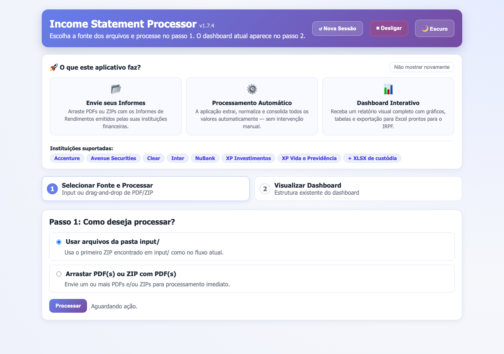 |  |

Card em detalhe:

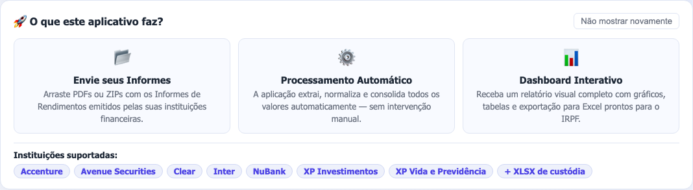

### Passo 1 – Selecionar Fonte e Processar

O usuário escolhe entre:
- **Usar arquivos da pasta `input/`** — detecta automaticamente o primeiro ZIP presente.
- **Arrastar PDF(s) ou ZIP(s)** — dropzone com suporte a múltiplos arquivos (`.pdf`, `.zip`, `.aspx`, `.asp`, `.xlsx`, `.xls`).

Após clicar em **Processar**, um painel de progresso exibe: estágio atual, percentual, arquivos concluídos, tempo decorrido e ETA.

### Passo 2 – Visualizar Dashboard

O dashboard gerado é exibido em um `<iframe>` que ocupa praticamente toda a viewport, permitindo navegação completa sem sair da tela.

---

## 📸 Visualizações

### Tema Claro (Light Mode)

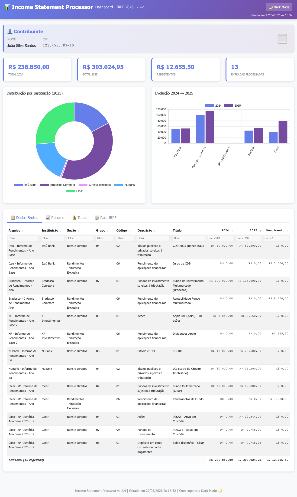

A visualização padrão em tema claro com cores vibrantes e contraste otimizado para leitura durante o dia.

#### Seção de Gráficos (Light)

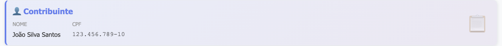

Pie chart de distribuição por instituição e bar chart de evolução 2024 vs 2025 em tema claro.

#### Tabela de Dados (Light)

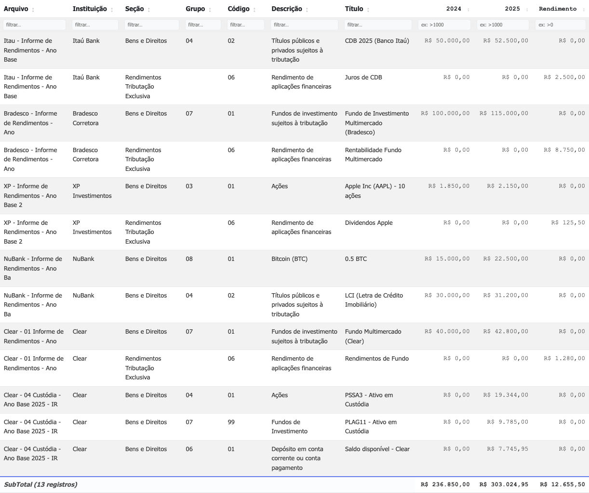

Dados brutos com todas as colunas, formatação de moeda brasileira e hover effects.

### Tema Escuro (Dark Mode)

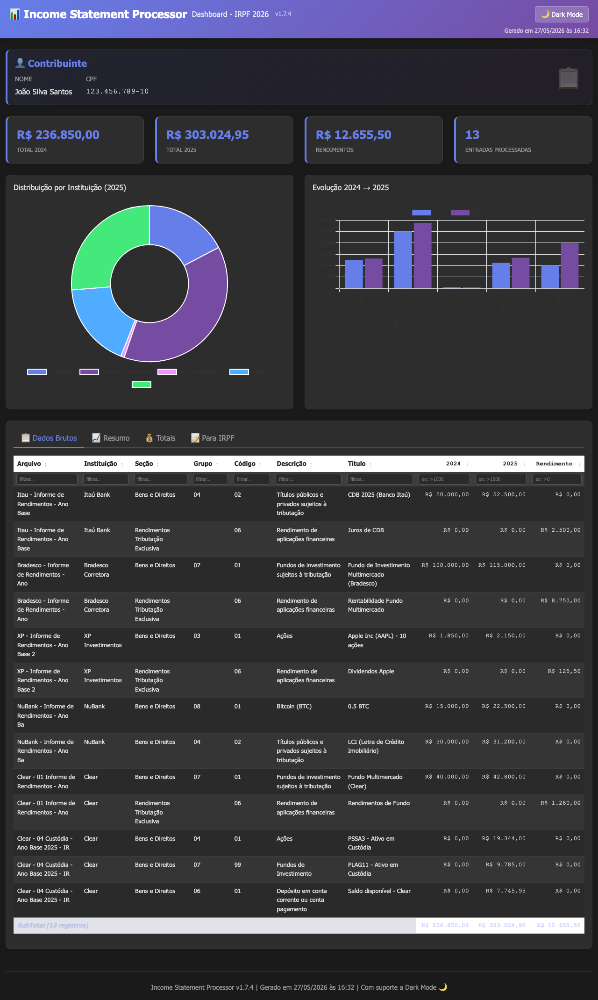

Tema escuro para melhor experiência noturna, com cores ajustadas para legibilidade em fundo escuro.

#### Seção de Gráficos (Dark)


Mesmos gráficos em tema escuro com cores invertidas para conforto visual.

### Responsividade

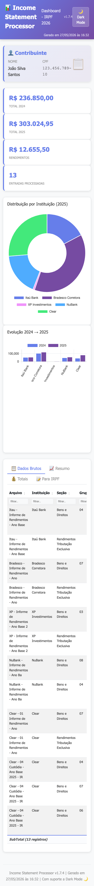

Visualização em dispositivo móvel (375px) com layout adaptado e tabelas com scroll horizontal.

## 🏗️ Arquitetura

### Fluxo de Dados

```
src/main.py (pipeline)
    ↓
[all_entries: list[Entry]]
    ↓
src/dashboard_generator.py
    ├─ generate_dashboard_html(entries, output_path)
    │
    ├─ Extrai dados para JSON:
    │  ├─ Arquivo truncado (40 chars)
    │  ├─ Instituição, Seção, Grupo, Código, Descrição, Discriminação
    │  ├─ assetCategory  ← calculado por infer_asset_category(entry)
    │  ├─ fixedIncomeSubtype  ← calculado por _infer_fixed_income_subtype()
    │  ├─ Valores: v2024, v2025, rendimento, irrf
    │
    ├─ Calcula métricas:
    │  ├─ total_2024, total_2025, total_rendimento, total_irrf
    │
    └─ Gera HTML com:
       ├─ Template inline (não exige servidor)
       ├─ JSON embarcado no <script>
       ├─ Funções JavaScript para rendering
       └─ Styles Bootstrap + CSS customizado
```

### Componentes JavaScript

#### Funções de Formatação

```javascript
formatCurrency(value)  // Intl.NumberFormat('pt-BR', {style: 'currency'})
switchTab(tabName, event)  // Alterna abas ativas
```

#### Funções de Preenchimento

```javascript
populateDadosBrutos()    // Cria <tr> para cada entrada
populateResumo()         // Agrupa por seção + instituição
populateTotais()         // Agrupa por grupo + código, adiciona total
populaParaIRPF()         // Seções por instituição → acordeões por tipo de ativo
irpfAssetCategory(r)     // Retorna r.assetCategory (calculado em Python)
irpfDisplayLabel(r)      // Rótulo de exibição: usa r.fixedIncomeSubtype ou r.descricao
hasToken(d, token)       // Word-boundary match (espelho do _contains_token Python)
irpfSubtypeFromDiscriminacao(d)  // Deriva subtipo de renda fixa a partir de discriminacao
```

#### Inicialização

```javascript
initCharts()             // Cria pie chart + bar chart com Chart.js
document.addEventListener('DOMContentLoaded', ...)  // Dispara ao carregar
```

## 📝 Uso Programático

### Gerar Dashboard de Forma Independente

```python
from src.dashboard_generator import generate_dashboard_html
from src.models import Entry

# Lista de entradas
entries = [
    Entry(arquivo='test.pdf', instituicao='XP', ...),
    Entry(arquivo='test.pdf', instituicao='Avenue', ...),
]

# Gerar dashboard
generate_dashboard_html(entries, 'meu_dashboard.html')

# Resultado:
# ✅ Dashboard gerado: meu_dashboard.html
#    Entradas: 2
#    Total 2024: R$ X.XXX,XX
#    Total 2025: R$ Y.YYY,YY
#    Total Rendimentos: R$ Z.ZZZ,ZZ
```

### Integração no Pipeline (Automático)

```bash
python3 -m src.main
# Processa ZIP → XLSX → Dashboard HTML (+ Google Sheets se habilitado)
```

## 📊 Detalhes dos Gráficos

### Gráfico de Evolução (2024 → 2025)

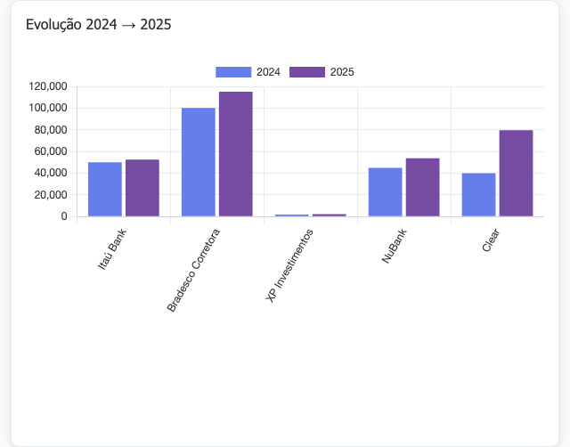

**Características:**
- Tipo: Bar chart com duas séries (2024 em azul, 2025 em roxo)
- Eixo X: Nomes das instituições (truncados pela configuração)
- Eixo Y: Valores em Real (BRL)
- **Nova Configuração**: Rótulos com rotação de **45 graus** (via `config.toml`)
- Hover: Exibe valor exato com formatação brasileira
- Responsivo: Adapta automaticamente em telas menores

**Configuração da Rotação** (`config.toml`):
```toml
[dashboard]
# Chart X-axis label rotation (degrees)
chart_label_rotation = 45  # Pode variar entre 0-90
```

### Gráfico de Distribuição por Instituição (2025)

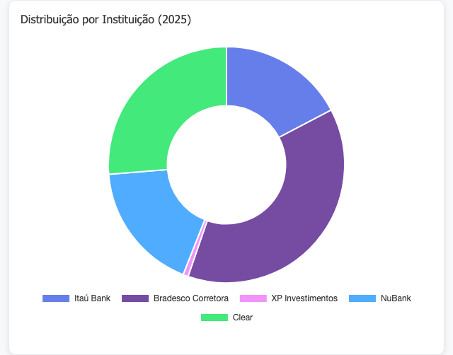

**Características:**
- Tipo: Pie/Doughnut chart
- Dados: Consolidação de `valor_2025` por instituição
- Cores: Palette com 8 cores gradiente (roxo → azul → rosa → verde)
- Legenda: Posicionada na parte inferior
- Interação: Clique para destacar/esconder série

### Abas de Dados

#### Aba: Resumo (Resumo por Seção/Instituição)

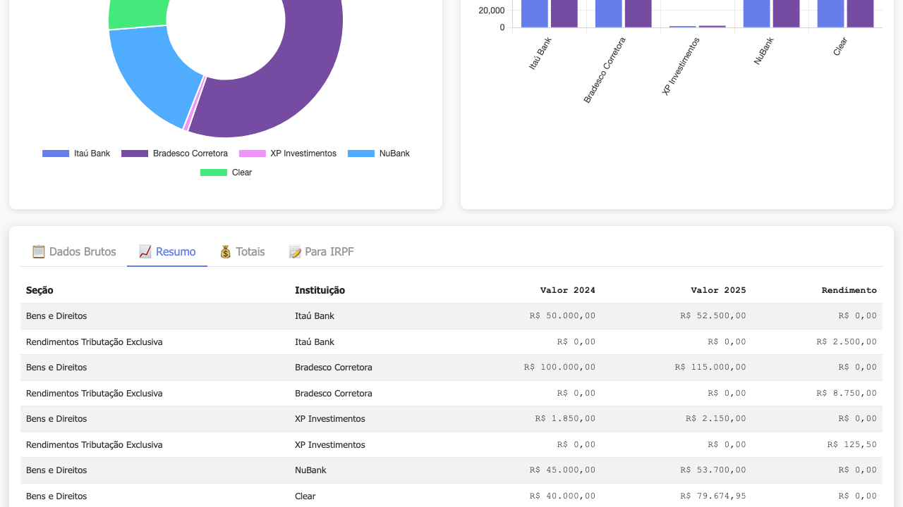

Agregação de dados por Seção e Instituição com totais consolidados.

#### Aba: Totais (IRPF Total)

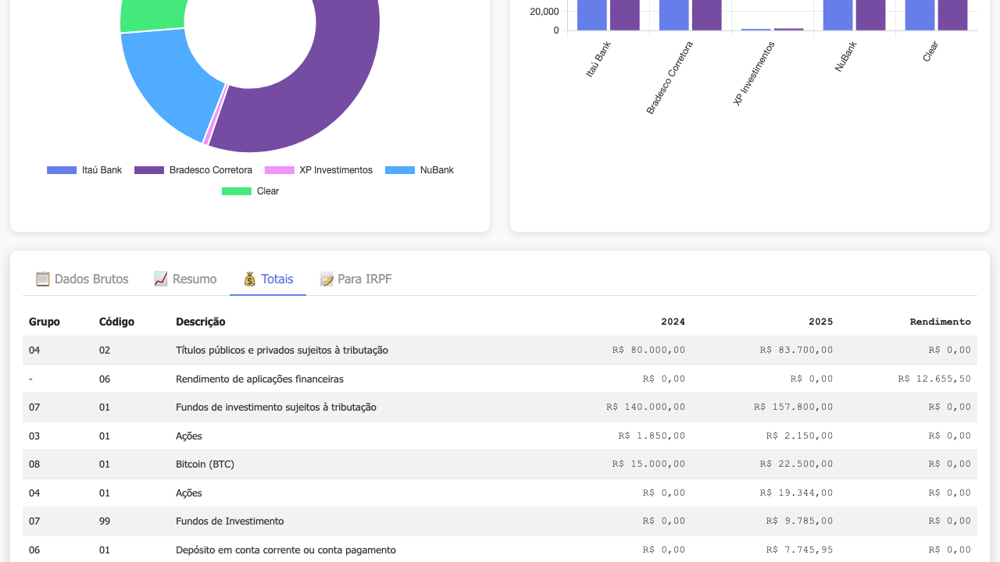

Visão consolidada por Grupo e Código IRPF, essencial para preenchimento da Declaração de Imposto de Renda.

## 🎨 Customização

### Alterar Cores

Edite o CSS no arquivo HTML gerado ou no template `src/dashboard_generator.py`:

```css
/* Cores principais */
.navbar { background: linear-gradient(135deg, #667eea 0%, #764ba2 100%); }
.metric-value { color: #667eea; }
.nav-tabs .nav-link.active { border-bottom: 2px solid #667eea; }
```

**Paleta padrão:**
- Primário: `#667eea` (azul roxo)
- Secundário: `#764ba2` (roxo)
- Destaque: `#f093fb` (rosa), `#4facfe` (azul claro), `#43e97b` (verde)

### Adicionar Novas Abas

1. No HTML, adicione nova `<li>` na navegação:
   ```html
   <li class="nav-item">
       <a class="nav-link" href="#" onclick="switchTab('nova-aba', event)">📊 Nova Aba</a>
   </li>
   ```

2. Adicione `<div id="nova-aba">` no `tab-content`:
   ```html
   <div id="nova-aba" class="tab-content">
       <!-- conteúdo aqui -->
   </div>
   ```

3. Crie função JavaScript `populateNovaAba()` e chame em `DOMContentLoaded`.

### Modificar Gráficos

Chart.js suporta múltiplos tipos:
- `'pie'`: Gráfico de pizza
- `'bar'`: Gráfico de barras
- `'line'`: Gráfico de linhas
- `'doughnut'`: Rosca
- `'radar'`: Radar

Exemplo — adicionar linha do tempo:

```javascript
new Chart(document.getElementById('chartTimeline'), {
    type: 'line',
    data: {
        labels: ['Jan', 'Fev', 'Mar', ...],
        datasets: [{
            label: '2025',
            data: [100, 110, 115, ...],
            borderColor: '#764ba2'
        }]
    }
});
```

## 🔧 Configuração

### `config.toml`

```toml
[output]
xlsx_path = "output/informes_rendimentos.xlsx"
dashboard_path = "output/dashboard.html"  # novo em v1.0.1
```

### Variáveis de Ambiente (Futuro)

```bash
export DASHBOARD_THEME="light"  # light, dark, custom
export DASHBOARD_CHARTS="pie,bar,line"  # habilitados
export DASHBOARD_LANGUAGE="pt-BR"  # pt-BR, en, es
```

## 📱 Responsividade

### Breakpoints (Bootstrap)

| Dispositivo | Width | Layout |
|------------|-------|--------|
| Mobile | < 576px | 1 coluna |
| Tablet | 576-768px | 2 colunas |
| Laptop | 768-992px | 2 colunas |
| Desktop | > 992px | 4 cards + 2 charts |

### Tabelas Responsivas

```css
.table-responsive {
    overflow-x: auto;  /* Scroll horizontal em mobile */
}
```

## 🐛 Troubleshooting

| Problema | Causa | Solução |
|----------|-------|---------|
| Gráfico não aparece | Chart.js CDN indisponível | Cheque conexão internet |
| Tabelas distorcidas | Tela muito estreita | Use modo landscape ou desktop |
| Moeda não formatada | Navegador antigo | Atualize para versão recente |
| Dashboard vazio | Nenhuma entrada | Verifique se PDFs foram processados |

## 📈 Próximos Passos (Roadmap)

- [ ] Print-to-PDF (CSS @media print)
- [ ] Exportar para CSV/JSON via botão
- [ ] Temas escuros (dark mode)
- [ ] Filtros interativos (por instituição, seção)
- [ ] Gráficos adicionais (treemap, heatmap)
- [ ] API REST para gerar dashboard via endpoint

## 📚 Referências

- **Bootstrap 5.3**: https://getbootstrap.com/
- **Chart.js**: https://www.chartjs.org/
- **Intl.NumberFormat**: https://developer.mozilla.org/en-US/docs/Web/JavaScript/Reference/Global_Objects/Intl/NumberFormat

---

**Versão**: 1.0.1  
**Data**: 2026-05-02  
**Autor**: Pedro Carlos Ferreira Santos
